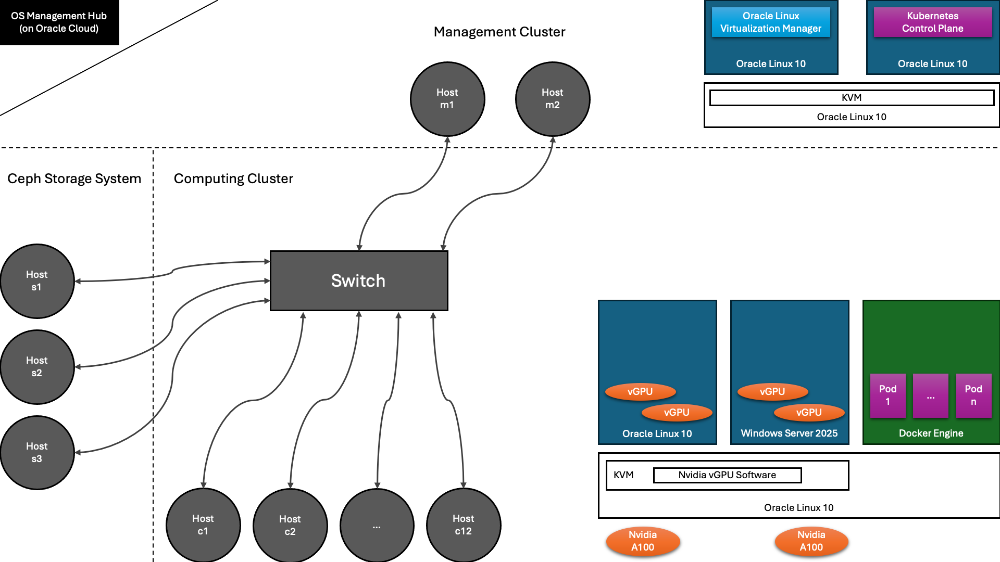

# AI Platform Engineering Notes
This repo contains the engineering notes of an *On-prem Enterpise AI Platform* with *Oracle Linux KVM*, *Oracle Linux Virtualization Manager*, *Docker* and *Kubernetes* on top of the AMD EPYC 9225 CPUs and Nvidia A100 GPUs.

## Overview of the AI Platform

## Index
### Virtualize the Nvidia A100 GPU in Oracle Linux 10
