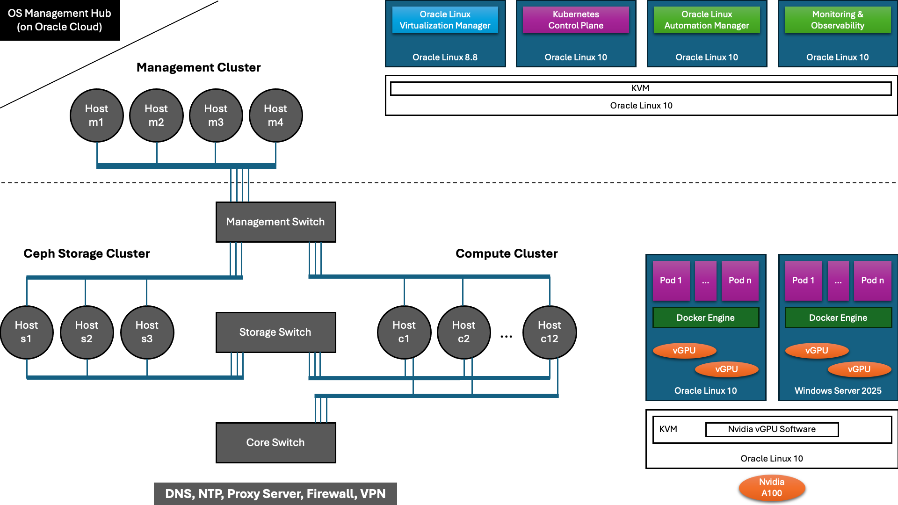

# AI Platform Engineering Notes
This repo contains the engineering notes of an *On-prem Enterpise AI Platform* with *Oracle Linux KVM*, *Oracle Linux Virtualization Manager*, *Docker*, *Kubernetes* (specically, Oracle Cloud Native Environment) and *DevOps and AIOps* tools (e.g., Kubeflow) on top of the AMD EPYC 9225 CPUs and Nvidia H100 GPUs.

## Overview of the AI Platform

## Index
### Virtualize the Nvidia H100 GPU in Oracle Linux
